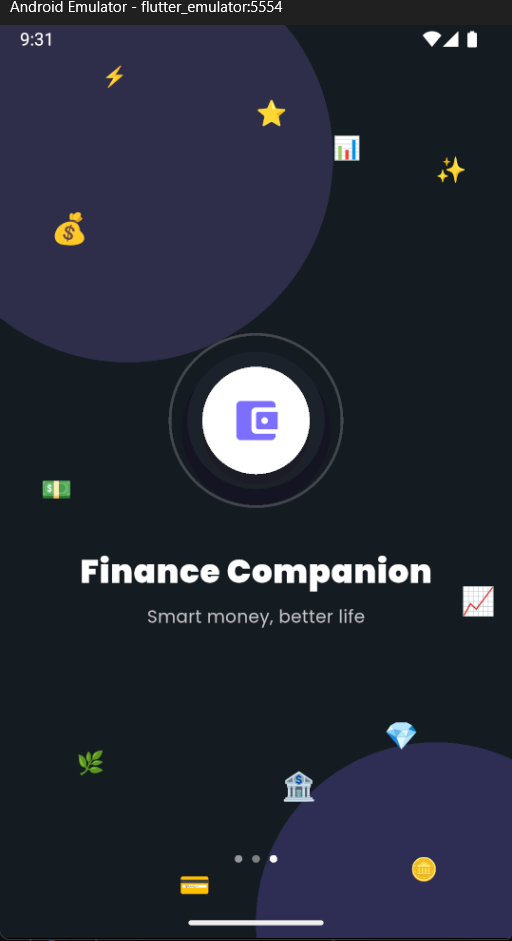
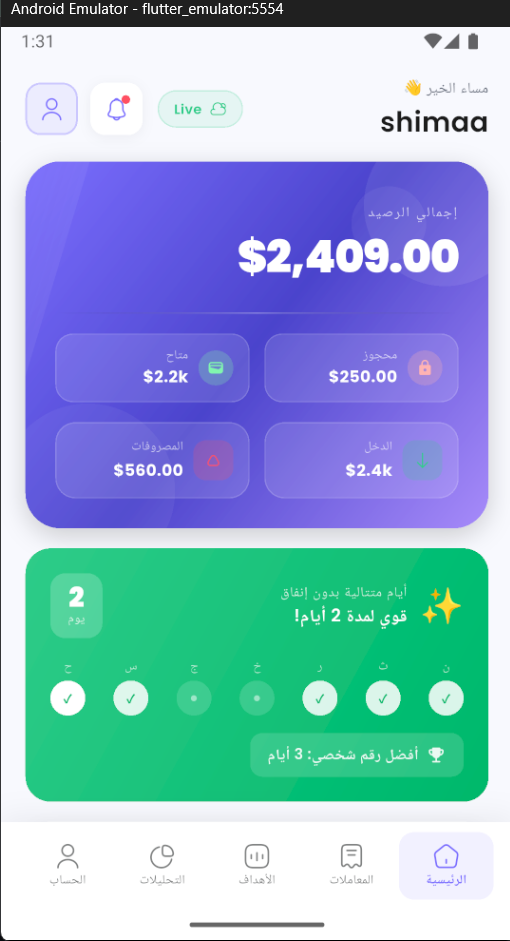
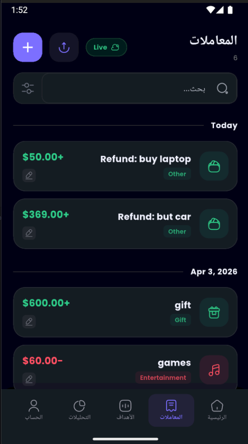
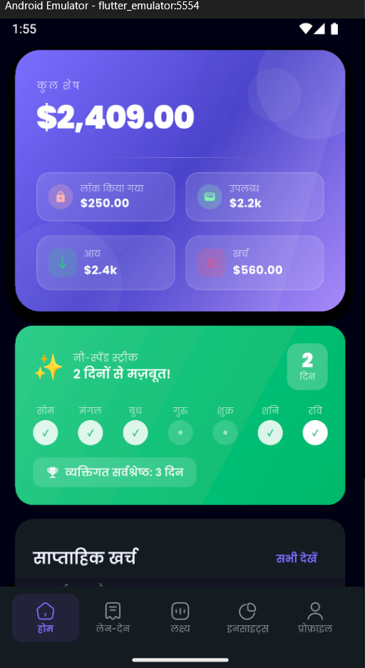
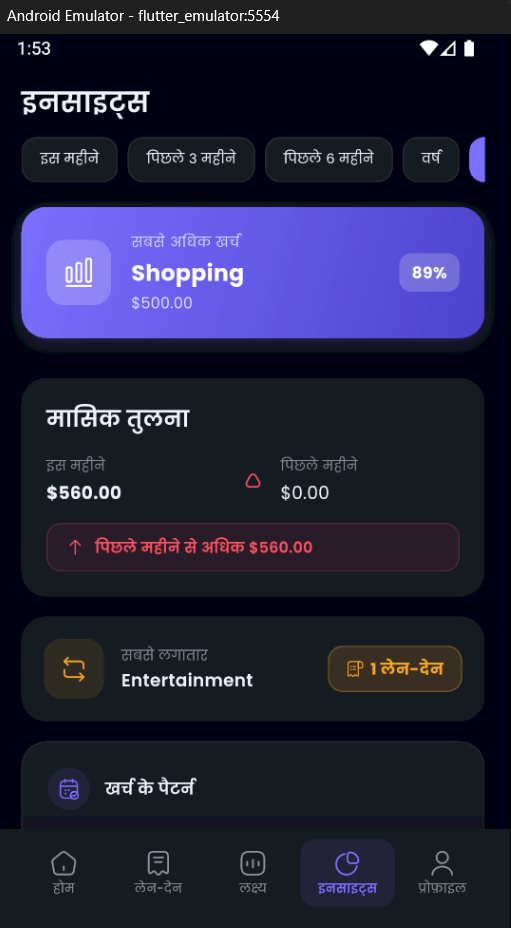

# 💰 Finance Companion

A masterfully crafted, production-quality personal finance application built with Flutter. Optimized for performance, security, and multi-platform accessibility.

---

## 📱 Screenshots

### 🎨 App Branding & Onboarding
| Splash Screen | Onboarding 1 | Onboarding 2 | Onboarding 3 |
|---|---|---|---|
|  |  |  |  |

| Auth (Login) | Auth (Sign Up) | User Profile |
|---|---|---|
|  |  |  |

### 🌍 Premium RTL Support (Arabic)
| Home & Insights | Transactions List |
|---|---|
|  |  |

### 🇮🇳 Hindi Language Integration
| Hindi Dashboard | Hindi Insights |
|---|---|
|  |  |

### 📊 Modern UI (English)
| Dashboard (Dark) | Dashboard (Light) |
|---|---|
|  |  |

| Transactions Explorer | Savings Goals |
|---|---|
|  |  |

| Deep Insights | Charts & Trends | Notifications |
|---|---|---|
|  |  |  |


---

## ✨ Key Features

- **🌐 Multi-Platform Excellence** — Seamlessly runs on **Android, iOS, and Web (Chrome)** with specialized SQLite web support.
- **🔒 Biometric Security** — Keep your data safe with **Fingerprint, Face ID, or Passcode** entry, integrated directly into the splash sequence.
- **🌍 Full Localization** — Native-level support for **English and Arabic**, including full RTL (Right-to-Left) layout transitions.
- **💾 Offline-First Design** — High-performance local storage using `sqflite` (Mobile) and `IndexedDB` (Web) with background Firebase synchronization.
- **📊 Advanced Analytics** — Dynamic charts, spending pattern analysis, and time-period filtering (Month, 3M, 6M, Year).
- **🎯 Dynamic Goals** — Set, track, and celebrate savings milestones with haptic feedback and visual celebrations.
- **📝 CSV Export** — Generate and share professional financial reports in CSV format directly from your device.
- **🔔 Smart Notifications** — Proactive alerts for budget breaches, goal deadlines, and streak maintenance.

---

## 🛠 Tech Stack

| Component | Technology |
|---|---|
| **Framework** | Flutter 3.x (Dart 3) |
| **State Management** | `flutter_bloc` (Cubit Pattern) |
| **Local Database** | `sqflite` (Android/iOS) + `sqflite_common_ffi_web` (Web) |
| **Cloud Engine** | Firebase Firestore & Auth |
| **Visual Library** | `fl_chart`, `iconsax`, `google_fonts` |
| **Utilities** | `uuid`, `intl`, `equatable`, `local_auth`, `share_plus` |

---

  ## 🚀 Professional Architecture

  The app follows a strict **Layered Architecture** for maximum maintainability:

  ```text
  lib/
  ├── core/         # Theme, Constants, Utils, Shared Logic
  ├── data/         # Models, Repositories, API/DB Services
  ├── logic/        # State Management (Cubit)
  └── presentation/ # UI Screens, Widgets, Navigation
  ```

---

  ## 🏁 Getting Started

  ### 1. Prerequisites
  - Flutter SDK `^3.10.0`
  - Android Studio / VS Code with Flutter extension

  ### 2. Quick Install
  1. Clone the repository:
    ```bash
    git clone https://github.com/Israa-e/Finance-Companion.git
    ```
  2. Install dependencies:
    ```bash
    flutter pub get
    ```
  3. Launch on your favorite platform:
    ```bash
    flutter run -d chrome  # For Web
    flutter run            # For Mobile
    ```

  ### 3. Firebase Configuration
  The app runs in **Demo Mode (Local-Only)** by default if Firebase is not detected. To enable cloud sync, provide your `google-services.json` or `GoogleService-Info.plist` and configure `lib/firebase_options.dart`.

  ---

  ## 📄 Version History (v2.0.0)

  - **[NEW]** Added **Web Support** via `sqflite_common_ffi_web`.
  - **[NEW]** Implemented **Biometric Security** with `local_auth`.
  - **[NEW]** Fixed **Category Cubit** scoping across all navigation routes.
  - **[NEW]** Improved **RTL UI** consistency for Arab users.

  ---

  Made with ❤️ by [Israa](https://github.com/Israa-e)