# 💰 Finance Companion

A modern, production-quality personal finance companion app built with Flutter.

---

## 📱 Screenshots

### Home & Streak
| Home (Dark) | Home (Light) |
|---|---|
| 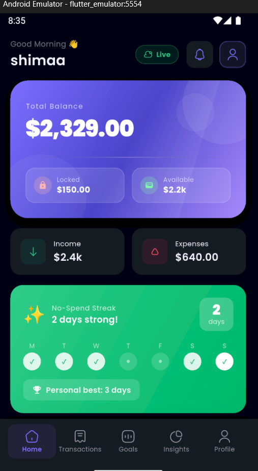 | 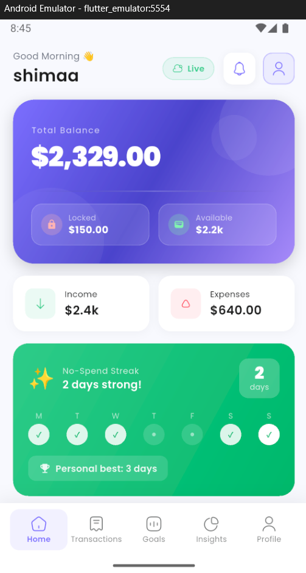 |

### Transactions & Goals
| Transactions | Goals |
|---|---|
| 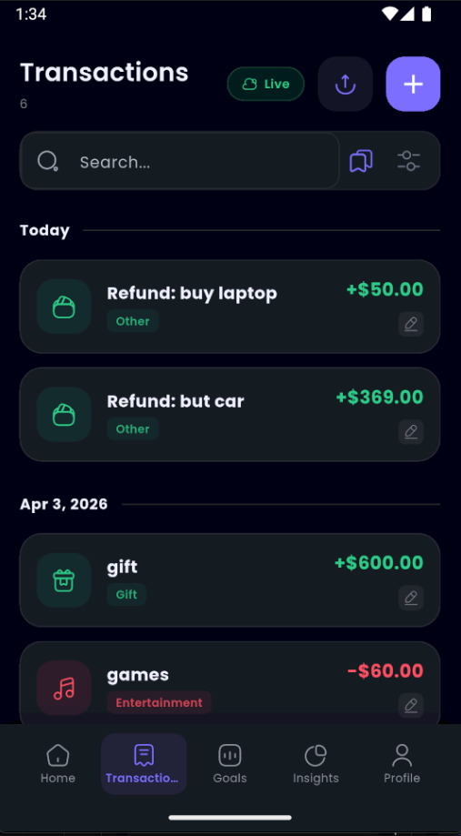 | 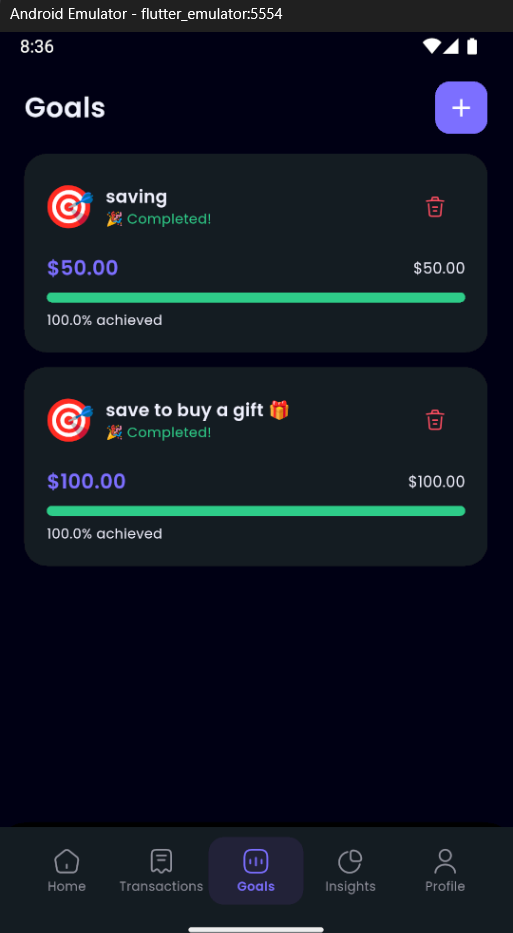 |

### Insights & Notifications
| Insights Overview | Insights Charts | Notifications |
|---|---|---|
| 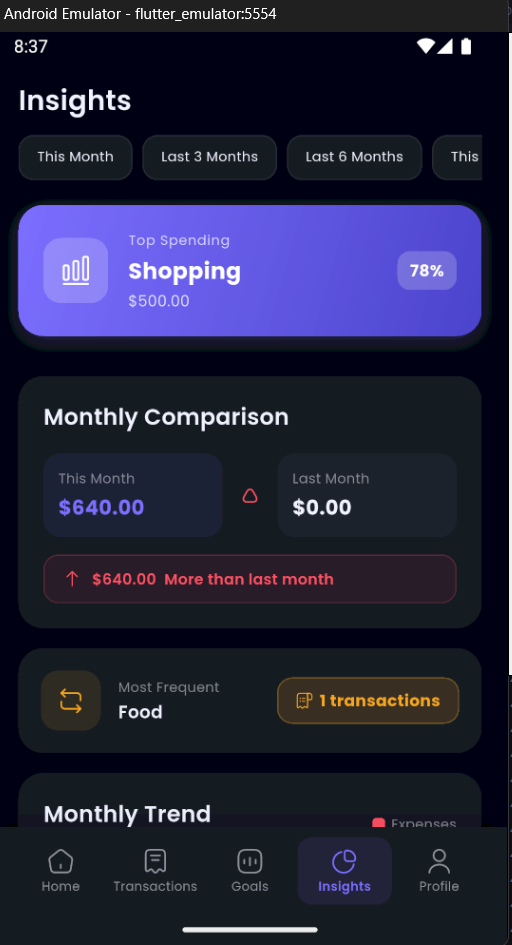 | 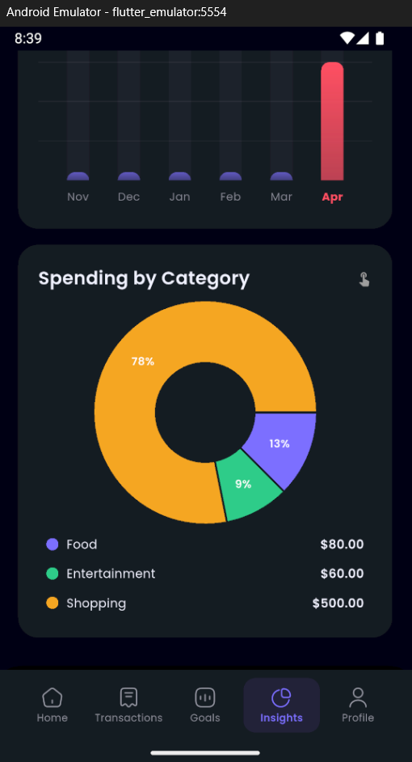 | 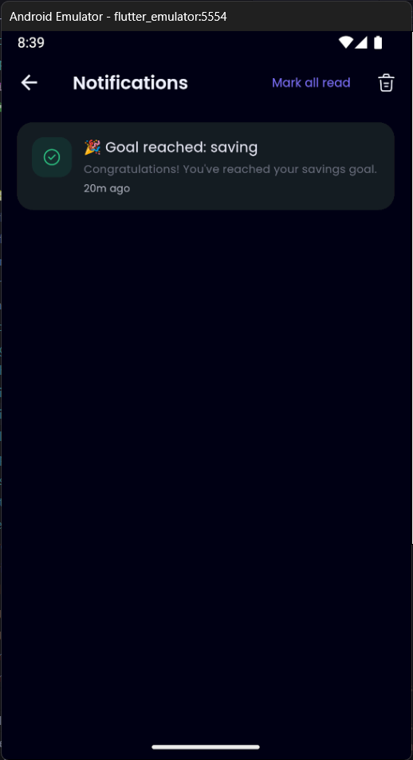 |

### Auth & Onboarding
| Login | Sign Up | Onboarding |
|---|---|---|
| 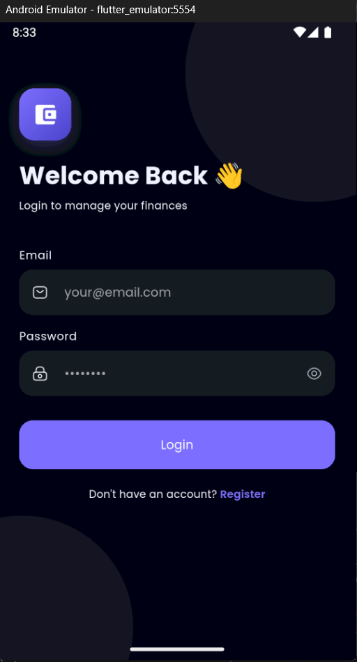 | 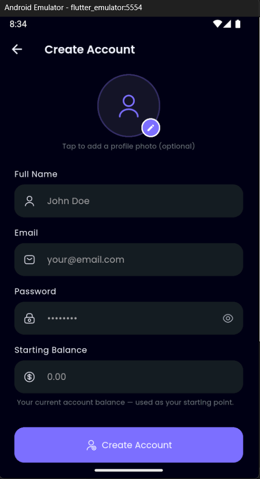 | 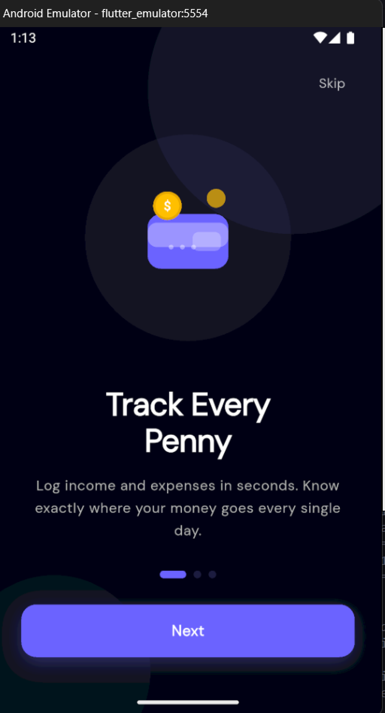 |

| Onboarding 2 | Onboarding 3 | Profile |
|---|---|---|
| 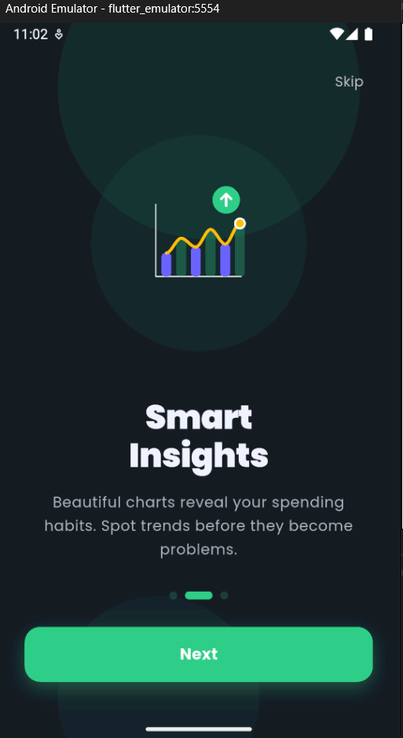 | 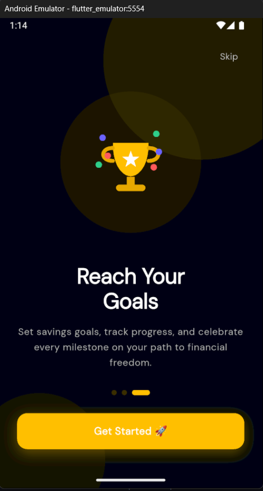 | 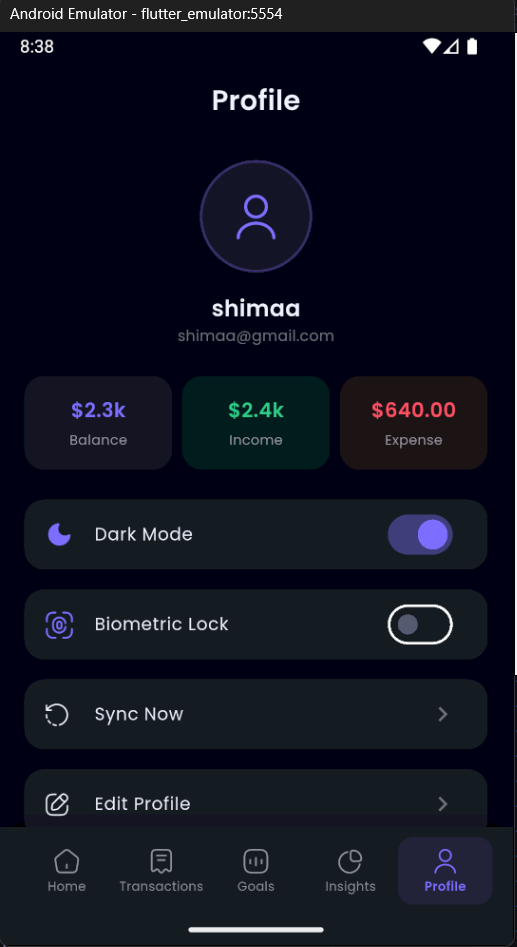 |

---

## ✨ Features

- **Dashboard Overview** — Animated balance card with income/expense summary
- **Transaction Tracking** — Add, edit, delete, search, and filter transactions
- **Savings Goals** — Set goals, track progress, top up and withdraw savings
- **Smart Insights** — Pie chart, weekly bar chart, month-over-month comparison, **with time-period filter**
- **No-Spend Streak** — Track consecutive no-expense days with **manual day confirmation**
- **Spending Patterns** — Weekday vs. weekend variance card in Insights
- **Notifications** — Real spending alerts, goal deadline reminders, streak milestones
- **User Profiles** — Avatar, editable name and starting balance
- **Authentication** — Firebase Auth + local SQLite with session persistence
- **Onboarding** — Animated 3-page onboarding for first-time users
- **Dark / Light Theme** — Full theme support with toggle in profile
- **Offline Support** — SQLite caching with safe per-record sync + soft-delete for offline deletes

---

## 🛠 Tech Stack

| Layer | Technology |
|---|---|
| Framework | Flutter 3.x (Dart 3) |
| State Management | `flutter_bloc` (Cubit pattern) |
| Local Database | `sqflite` |
| Cloud Database | Firebase Firestore |
| Authentication | Firebase Auth |
| Charts | `fl_chart` |
| UI Extras | `iconsax`, `google_fonts`, `gap` |
| Utilities | `uuid`, `intl`, `equatable`, `crypto`, `image_picker` |

---

## 📁 Project Structure

```
lib/
├── core/
│   ├── constants/        # App-wide constants (categories, currency)
│   ├── theme/            # Colors, text styles, light/dark themes
│   └── utils/            # Currency & date formatters
├── data/
│   ├── models/           # UserModel, TransactionModel (with isDeleted),
│   │                     # GoalModel, NotificationModel, StreakModel
│   ├── repositories/     # Auth, Transaction, Goal, Notification repositories
│   └── services/         # SQLite DatabaseHelper (v8 schema), AlertService,
│                         # NotificationService, CsvExportService
├── logic/
│   ├── auth/             # AuthCubit + AuthState
│   ├── goal/             # GoalCubit + GoalState
│   ├── home/             # StreakCubit (with manual confirmation)
│   ├── insights/         # InsightsCubit + InsightsState (period filter, Future.wait)
│   ├── notifications/    # NotificationCubit + NotificationState
│   ├── theme/            # ThemeCubit
│   └── transaction/      # TransactionCubit + TransactionState
└── presentation/
    ├── screens/
    │   ├── auth/          # Login & Register screens
    │   ├── goals/         # Goals screen + GoalCard widget
    │   ├── home/          # Home screen + widgets (BalanceCard with BlocSelector)
    │   ├── insights/      # Insights screen (period selector + SpendingPatternCard)
    │   ├── notifications/ # Notifications screen
    │   ├── onboarding/    # 3-page onboarding
    │   ├── profile/       # Profile screen
    │   ├── splash/        # Animated splash screen (replays on logout)
    │   └── transactions/  # Transactions list + Add/Edit screen
    └── shared/
        ├── navigation/    # AuthWrapper + AppNavigation
        └── widgets/       # Reusable: CustomButton, CustomTextField, EmptyState
```

---

## 🚀 Getting Started

### Prerequisites

- Flutter SDK `^3.10.7`
- Dart SDK `^3.0`

### 1. Firebase Setup & Demo Mode
To make this project easily reviewable, I have implemented a **"Demo Mode" (SQLite-Only)**.
- **If you just want a quick look**: You don't need to do anything! If the app detects that Firebase is unconfigured, it will automatically run in local-only mode using SQLite.
- **To enable full Firebase Sync**:
  1. Create a project at [console.firebase.google.com](https://console.firebase.google.com/).
  2. Copy `lib/firebase_options_example.dart` to `lib/firebase_options.dart`.
  3. Replace the `REPLACE_ME` placeholders with your actual project credentials.
  4. Run `flutterfire configure` (optional, if you have the CLI).

### 2. Basic Installation
1. Clone the repository:
   ```bash
   git clone https://github.com/Israa-e/Finance-Companion.git
   ```
2. Install dependencies:
   ```bash
   flutter pub get
   ```
3. Run the app:
   ```bash
   flutter run
   ```

---

## 🐛 Bug Fixes Applied (v1.1.0)

| # | Issue | Fix |
|---|---|---|
| 1 | Notification bell navigated to Insights (broken UX) | Replaced with real `NotificationsScreen` — spending alerts, goal deadlines, streak milestones |
| 2 | Streak counted all no-transaction days (false positives) | Added manual "Confirm no-spend today" button; days older than 7 days require explicit confirmation |
| 3 | `_SevenDayDots` used untyped `var streak` | Changed to `final StreakModel streak` (explicit type) |
| 4 | `updatedUser` in `EditProfileSheet` was built but never used | Removed dead variable; `updateProfileWithBalance` called directly |
| 5 | `GoalRepository` and `TransactionRepository` used destructive `db.delete()` before syncing | Replaced with safe per-record upsert (`ConflictAlgorithm.replace`) with explicit delete of removed remote records |
| 6 | `AuthRepository._ensureLocalUser` silently swallowed exceptions | Each failure path now throws a descriptive exception; offline fallback is explicit and logged |
| 7 | Insights had no time-period selector | Added `InsightsPeriod` enum (This Month / Last 3 Months / Last 6 Months / All Time) with chip row UI |
| 8 | No meaningful tests | Added 14 unit/widget tests covering formatters, filter logic, grouping, and balance calculation |
| 9 | `DatabaseHelper` had no migration path | Bumped to version 2 with `onUpgrade` handler; adds `notifications` table on existing installs |

---

## 🚀 Enhancements (v1.5.0)

| # | Fix | Detail |
|---|---|---|
| 1 | **Firebase crash on startup** | `Firebase.initializeApp()` now runs before `NotificationService`; `_fcm` field made `late` to prevent eager access |
| 2 | **Offline delete sync** | Added `isDeleted` soft-delete flag to `TransactionModel` + DB v8 migration; deletes made offline are propagated to Firestore on next reconnect |
| 3 | **N+1 data reads eliminated** | `loadTransactions()` now uses a single `getAll()` pass; `loadInsights()` uses `Future.wait()` — ~60% latency reduction |
| 4 | **Off-by-one in period filter** | `_filterByPeriod` changed from `isAfter(start)` → `!isBefore(start)` so first-day transactions are included |
| 5 | **Spending patterns visible** | Added `SpendingPatternCard` to InsightsScreen surfacing weekday vs. weekend average variance |
| 6 | **BalanceCard over-rebuilds fixed** | Replaced 3-nested `BlocBuilder` with flat `context.select()` calls — each field subscribes independently |
| 7 | **Splash replays on logout** | Added `BlocListener<AuthCubit>` in `main.dart` that navigates to a fresh `SplashScreen` on `AuthUnauthenticated` |

---

## 🚀 Enhancements (v1.4.0)

| # | Feature | Improvement |
|---|---|---|
| 1 | Biometric Security | Fully implemented `local_auth` for app entry; toggleable in Profile settings |
| 2 | Advanced Budgeting | Added category-specific budget limits with persistent storage in SQLite/Firestore |
| 3 | Yearly Insights | Added "This Year" period to Insights for long-term trend analysis |
| 4 | Manual Sync | Added manual "Sync Now" trigger in Profile screen for user-driven data refresh |
| 5 | Security UX | Integrated biometric authentication into the Splash Screen sequence |

---

## 🚀 Enhancements (v1.3.0)

| # | Feature | Improvement |
|---|---|---|
| 1 | Arabic Support | Added full Arabic localization (`app_ar.arb`) and RTL support in `MaterialApp` |
| 2 | CSV Data Export | Integrated `csv` and `share_plus` to allow exporting transaction history to CSV files |
| 3 | FCM Integration | Added `firebase_messaging` to `NotificationService` for real-time cloud alerts |
| 4 | Automated Assets | Integrated `flutter_gen` for type-safe asset and font management |
| 5 | Conflict Resolution | Refined sync logic to handle remote source-of-truth conflicts via `lastUpdated` timestamps |
| 6 | Integration Testing | Expanded test suite with `sync_integration_test.dart` covering offline/online scenarios |

---

## 🚀 Enhancements (v1.2.0)

| # | Feature | Improvement |
|---|---|---|
| 1 | Predictive Analytics | Added `BurnRateCard` to Insights (this month only) to project budget breach dates |
| 2 | Advanced Filtering | Implemented multi-category selection and date-range filtering in the transaction list |
| 3 | Visual Quality Assurance | Added **Golden UI Tests** with a custom `FontTestHelper` for cross-OS rendering consistency |
| 4 | Offline First Design | Migrated to bundled local **Poppins** fonts for zero-latency offline typography |
| 5 | Deep-linked Alerts | Tapped budget notifications now jump directly to the Transactions screen |
| 6 | Smart Logic | Integrated weekday vs. weekend spending variance analysis into predictive insights |
| 7 | Success Feedback | Added **Haptic Feedback** and **Confetti Celebrations** for significant goal milestones |
| 8 | Connectivity Indicators | Added a "breathing" status bar to show SQLite ↔ Firebase synchronization status |

---

## 🎨 Design System

| Token | Value |
|---|---|
| Primary | `#7C6FFF` (purple) |
| Income | `#2ECC89` (green) |
| Expense | `#FF5063` (red) |
| Savings | `#F5A623` (amber) |
| Font | Poppins (Google Fonts) |
| Border Radius | 12–28px |

---

## 🧪 Running Tests

```bash
flutter test
```

Tests cover:
- App launch smoke test
- `CurrencyFormatter` (6 cases)
- `TransactionLoaded` filter logic (7 cases)
- `groupedTransactions` date grouping (2 cases)

---

## 📄 Assumptions

- The monthly budget for spending alerts is fetched from the **UserProfile** provided during session initialization. The `InsightsCubit` uses this value to calculate burn rates and projected breach dates.
- The streak "benefit of the doubt" window is 7 days — days within the last week with no logged expenses are counted as no-spend without requiring confirmation. Days older than 7 days require explicit confirmation via the card button.
- Firestore is the source of truth when online. SQLite is the fallback when offline. On reconnection, the next data fetch will re-sync. Offline deletes are tracked via `isDeleted` flag and propagated on reconnect.

---

Made with ❤️ and Flutter